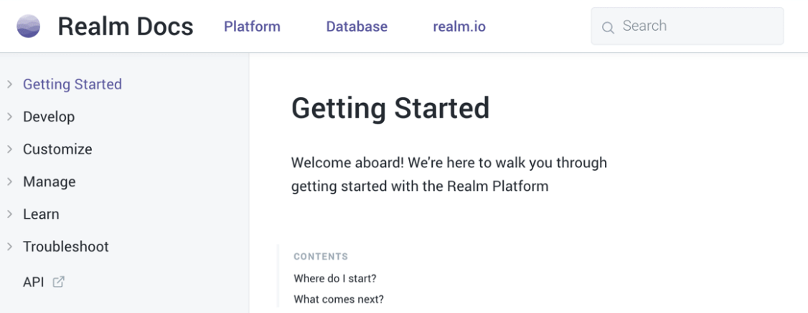

Markdown编辑器
```
Typora、MacDown、Bear、
MarkdownPad、MarkdownX、
Atom、简书、CSDN 
GitBook 自家的 GitBook Editor 
```
---
1.1 段落
# 一级标题
## 二级标题
### 三级标题

1.2 加粗、斜体
*单星号*
_单下划线_
**双星号**
__双下划线__

1.3 列表
1.3.1 无序列表示例：
* item1
* item2
* item3

1.3.2 有序列表示例：
1. item1
1. item2
1. item3

1.3.3 多级列表示例
* item1
 **-** item1.1
* item2
 **-** item2.1

1.4.1 普通区块
> 这是一段文字
>> 第二行
>>> 第三行

1.5.1 链接
这是[我的站点](http://www.gospace.top/zbook/ "一个GitBook搭建的站点")

1.5.2 图片
这是一张GitBook的效果图


2.1 关键字
公有声明关键字：`public`
主函数：`main(String[] args)`

2.2 段落
Java代码示例1：
<pre class=”brush: java; gutter: true;”>
// Java代码
class HelloImportnew {

}
</pre>

Java代码示例2：
```
// Java代码
class HelloImportnew {

}
```

2.3 表格

|Item|Value|Qty|
|:------|----------:|:---:|
|Computer|5600 RMB|3|
|Phone|7995 RMB|2|
|Bag|100 RMB|10|

2.4 复选框
- [x] 已完成事项
- [x] 待办事项1
- [ ] 待办事项2


3.1 流程图

```flow
st=>start: Start
e=>end
op=>operation: My Operation
cond=>condition: Yes or No?

st->op->cond
cond(yes)->e
cond(no)->op
```

3.2 时序图

```sequence
Alice->Bob: Hello Bob,how are you?
Note right of Bob: Bob thinks
Bob-->Alice: I am good thanks?
```